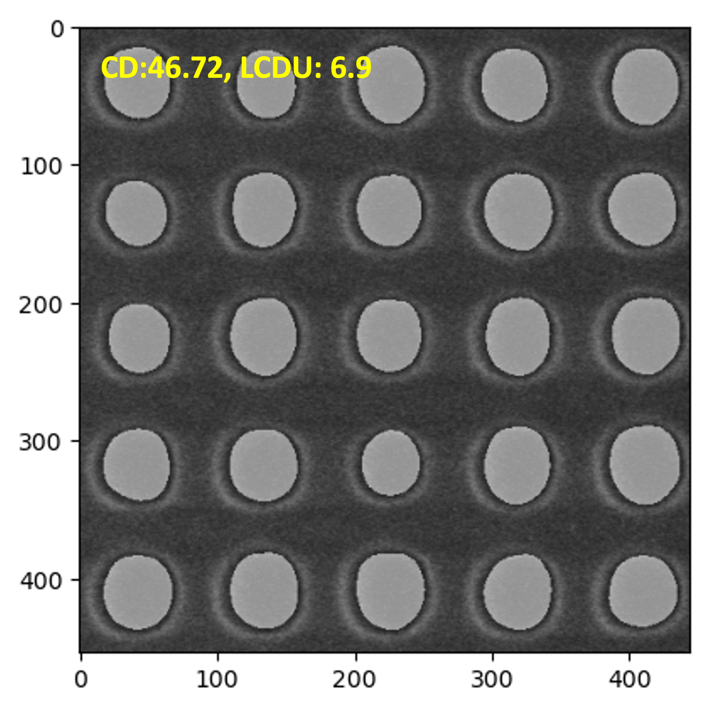

Script inspired from my work at Applied Materials on the effect of plasma on ultrathin polymer films for novel nanofabrication & pattern shaping using EUV lithography:  
(1) Binary collision Approximation (BCA) Monte Carlo.  
(2) SEM image processing using k-nearest neighbors (k-NN) algorithm.  

